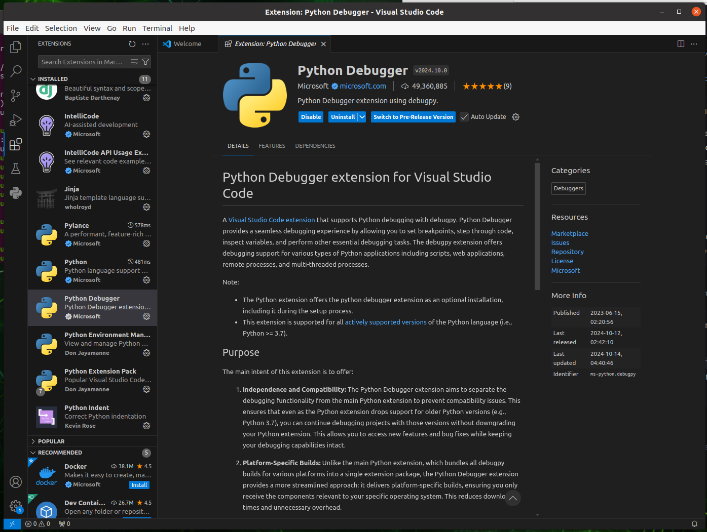

# Setup The Environment Using Anaconda

### Create a conda envrionment

**After rebooting the system,** simply enter the terminal, you will see that there is a **(base)** in front of your username. It is a base environment that conda build by default. Let’s check its python interpreter.

If the command print something **just like mine**, your base environment and anaconda is perfectly set!

```shell
which python
# /home/edwin/anaconda3/bin/python
which pip
# /home/edwin/anaconda3/bin/pip
pip --version
# pip 24.0 from /home/edwin/anaconda3/lib/python3.*/site-packages/pip (python 3.*)
python --version
# Python 3.*
```

Then, let’s create our **yolov8** conda environment with **python 3.8**

```shell
# create command, enter y to agree creates.
conda create -n yolov8 python=3.8 # -n set the name of our env.
# enter the environment.
conda activate yolov8
```

From now, you can see the **(yolov8) tag** in front of your username in terminal. Let’s check agian our python interpreter.

If you got the similar path as mine, and **the version of python is 3.8.*.** Congrats! 

```shell
which python
# /home/edwin/anaconda3/envs/yolov8/bin/python
which pip 
# /home/edwin/anaconda3/envs/yolov8/bin/pip
python --version
# Python 3.8.*
pip --version
# pip 24.0 from /home/edwin/anaconda3/envs/yolov8/lib/python3.8/site-packages/pip (python 3.8)
```

By the way, if you want to **exit the envrionment** 

```shell
conda deactivate
```

### Have a look in Visual Studio Code

Open the VSCode in lunch pad, and click the extension button (icon with blocks) on the left side bar, then search for following python extensions (Installed Section, Python related only):



### Setup Yolov8 Environment using Ultralytics

::: danger 
All Operation Should be Done on yolov8 Environment ! 
:::

Now, **we shall activate the yolov8 env and check all python interpreter is under the correct path.**

Download Ultralytics package. Go to terminal

```shell
# update the apt
sudo apt update
# install ultralytics package
pip install ultralytics[export]
# Mainland China
pip install ultralytics[export] -i https://pypi.tuna.tsinghua.edu.cn/simple
# After Installation complete, check the package.
pip list # list all packages under pip
conda list # list all packages under this envrionment
# the pip list and conda list should be generally same. conda list should have all pip list.
# you can see an important package called "ultralytics"
```

The above ultralytics installation will install Torch and Torchvision. However, these 2 packages installed via pip are not compatible to run on Jetson platform which is based on ARM64 architecture. Therefore, we need to manually install pre-built PyTorch pip wheel and compile/ install Torchvision from source. (from https://docs.ultralytics.com/guides/nvidia-jetson/#install-ultralytics-package)

1. Uninstall currently installed PyTorch and Torchvision

```shell
pip uninstall torch torchvision
```

2. Install PyTorch 2.1.0 according to JetPack 5.1.3

The key point here is the version of python, torch and torchvision should be 兼容,

`torch-2.1.0a0+41361538.nv23.06-cp38-cp38-linux_aarch64.whl` from this file name

- cp38: python 3.8
- linux_aarch64: Arm64 Architecture (Jetson’s Architecture)

That’s why envrionment set up is so important, bc if anyone of them is not correct, the program cannot be excuted.

```shell
cd ~/Downloads # go to downloads folder
# install dependency
sudo apt-get install -y libopenblas-base libopenmpi-dev
# wget is a installer that downloads by link
wget https://developer.download.nvidia.com/compute/redist/jp/v512/pytorch/torch-2.1.0a0+41361538.nv23.06-cp38-cp38-linux_aarch64.whl -O torch-2.1.0a0+41361538.nv23.06-cp38-cp38-linux_aarch64.whl
# install .whl file
pip install torch-2.1.0a0+41361538.nv23.06-cp38-cp38-linux_aarch64.whl
```

3. Install Torchvision v0.16.2 according to PyTorch v2.1.0

```shell
# install dependency
sudo apt install -y libjpeg-dev zlib1g-dev
# choose and create a directory you like to store the torchvision
mkdir -p ~/Dependency/
# go to it
cd ~/Dependenvcy
# clone the repository of torchvision
git clone https://github.com/pytorch/vision torchvision
# Mainland China
git clone https://gitclone.com/github.com/pytorch/vision torchvision
# go to the folder
cd torchvision
# switch to correct version
git checkout v0.16.2
# install
python3 setup.py install --user
```

4. Copy the TensorRT libraries to the Anaconda Virtual Environment

Because the TensorRT of Jetson is special and come with the JetPack, we need to copy the libraries to the conda environment.

```shell
# exit the conda environment
conda deactivate
conda deactivate # make sure there is no (base) or (yolov8) in front of your username
# check the location of TensorRT
pip show tensorrt
# copy the location of the library, * sign means all tensorrt files in the folder
cp -r /path/to/your/tensorrt* /home/yourusername/anaconda3/envs/yolov8/lib/python3.8/site-packages/
# mine is under /usr/lib/python3.8/dist-packages/
# activate the conda environment
conda activate yolov8
# check if the tensorrt is in the correct path
pip show tensorrt
```

After installation complete, Congratulations! You already setup the environment.

- conda create yolov8
- activate
- pip install 
- remove old torch and torchvision
- install right torch and torchvision
- copy tensorrt to the conda environment