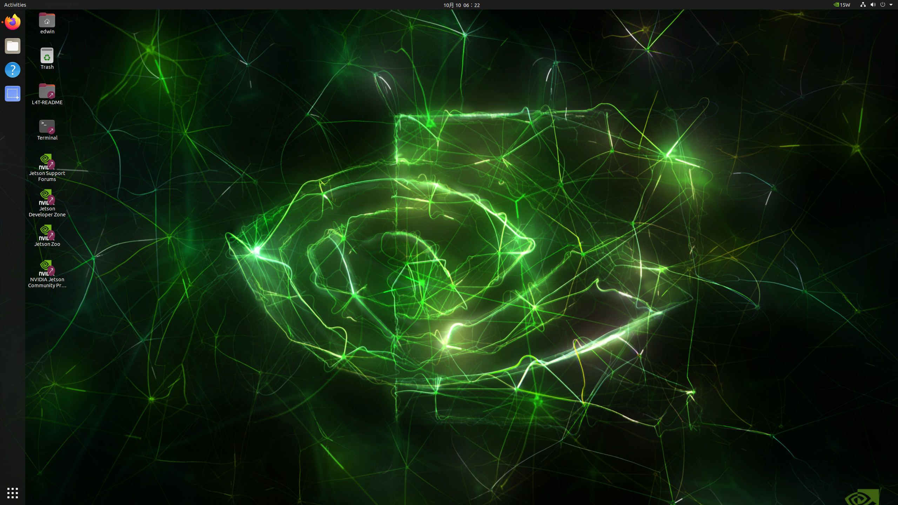
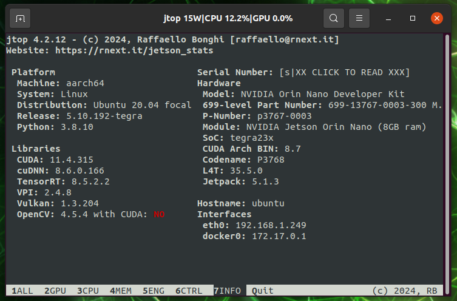

# Ubuntu desktop and Jetpack

This chapter will tell you how to use linux command line.

## linux command line

Using **CLI (Command Line Interface)** is a really important skill for computer science woker. Here is a [document](./Basic commands.md) that generate by OpenAI ChatGPT 4o, it teaches you some most useful commands in linux and ubuntu system. 

## Version Check

Alright! Let’s have a look to our Jetson desktop. If you see this cool and green Nvidia logo, that means you are in the Jetson linux system, there is a lot of shortcuts on the left hand of screen, but from now we don’t care about those. 

Generally, Jetson linux in a special version of ubuntu desktop, it just looks similar with other operating system like MacOS and Windows, easy to use, ez, ez.



### Jtop

The first thing I recommend is to install a powerful tool that allows you to manage and control the Jetson module, which is **Jtop**. So lets Open the terminal on the desktop, please make sure the internet is connected.

We need to use python3 and pip to install jtop (enter the command line by line)

```shell
# you need to type the password to allow sudo operation, the password will not show on the screen!
sudo apt install python3-pip #install pip
#install jtop
sudo -H pip install -U jetson-stats
#China Mainland, Using TUNA image from tsinghua U.
sudo -H pip install -U jetson-stats -i https://pypi.tuna.tsinghua.edu.cn/simple
#reboot the machine
reboot
#after reboot, open the terminal 
jtop
```

If the Jtop was successfully installed, then you can see a GUI system holds in terminal like this image.


Then, you need to check if the environment of your Jetson orin nano is same as mine, if not, you need to download *SDK Manager* on another **X86 Ubuntu 20.04** Machine to flash the same version as mine. Because the  **Jetpack 6** is still unstable and many of the softwares and dependencies are not working on that, I just use the latest version of Jetpack 5. Also the TensorRT, CUDA, cuDNN and OpenCV should be included. All Reinstallation can be done with SDK Manager (Follow the guide on https://developer.nvidia.com/sdk-manager)




