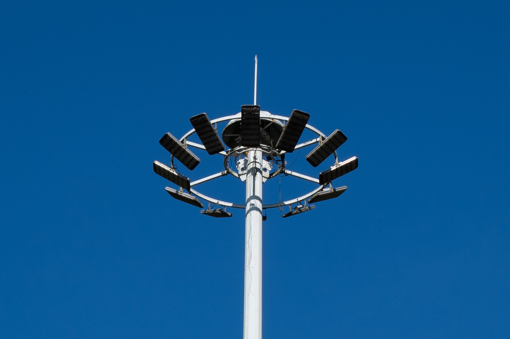

# Nikon D100 Featured
Shot with Nikon D100, edited in Lightroom

- **Camera Make**: NIKON CORPORATION
- **Camera Model**: NIKON D100
- **Shutter Speed**: 1/80 s
- **Aperture**: f/3.0
- **Focal Length**: 50 mm
- **Capture Date**: 2024-07-14
- **Lens Model**: 50.0 mm f/1.8

- **Camera Make**: NIKON CORPORATION
- **Camera Model**: NIKON D100
- **Shutter Speed**: 1/50 s
- **Aperture**: f/3.0
- **Focal Length**: 50 mm
- **Capture Date**: 2024-07-14
- **Lens Model**: 50.0 mm f/1.8

- **Camera Make**: NIKON CORPORATION
- **Camera Model**: NIKON D100
- **Shutter Speed**: 1/30 s
- **Aperture**: f/3.0
- **Focal Length**: 50 mm
- **Capture Date**: 2024-07-14
- **Lens Model**: 50.0 mm f/1.8

- **Camera Make**: NIKON CORPORATION
- **Camera Model**: NIKON D100
- **Shutter Speed**: 1/1250 s
- **Aperture**: f/8.9
- **Focal Length**: 50 mm
- **Capture Date**: 2024-07-16
- **Lens Model**: 50.0 mm f/1.8

- **Camera Make**: NIKON CORPORATION
- **Camera Model**: NIKON D100
- **Shutter Speed**: 1/1000 s
- **Aperture**: f/3.0
- **Focal Length**: 50 mm
- **Capture Date**: 2024-07-16
- **Lens Model**: 50.0 mm f/1.8

- **Camera Make**: NIKON CORPORATION
- **Camera Model**: NIKON D100
- **Shutter Speed**: 1/1000 s
- **Aperture**: f/3.0
- **Focal Length**: 50 mm
- **Capture Date**: 2024-07-16
- **Lens Model**: 50.0 mm f/1.8

- **Camera Make**: NIKON CORPORATION
- **Camera Model**: NIKON D100
- **Shutter Speed**: 1/640 s
- **Aperture**: f/3.0
- **Focal Length**: 50 mm
- **Capture Date**: 2024-07-16
- **Lens Model**: 50.0 mm f/1.8

- **Camera Make**: NIKON CORPORATION
- **Camera Model**: NIKON D100
- **Shutter Speed**: 1/200 s
- **Aperture**: f/7.6
- **Focal Length**: 55 mm
- **Capture Date**: 2024-07-15
- **Lens Model**: 55.0-200.0 mm f/4.0-5.6

- **Camera Make**: NIKON CORPORATION
- **Camera Model**: NIKON D100
- **Shutter Speed**: 1/60 s
- **Aperture**: f/4.6
- **Focal Length**: 55 mm
- **Capture Date**: 2024-07-15
- **Lens Model**: 55.0-200.0 mm f/4.0-5.6

- **Camera Make**: NIKON CORPORATION
- **Camera Model**: NIKON D100
- **Shutter Speed**: 1/160 s
- **Aperture**: f/4.6
- **Focal Length**: 122 mm
- **Capture Date**: 2024-07-15
- **Lens Model**: 55.0-200.0 mm f/4.0-5.6

- **Camera Make**: NIKON CORPORATION
- **Camera Model**: NIKON D100
- **Shutter Speed**: 1/160 s
- **Aperture**: f/8.9
- **Focal Length**: 100 mm
- **Capture Date**: 2024-07-15
- **Lens Model**: 55.0-200.0 mm f/4.0-5.6

- **Camera Make**: NIKON CORPORATION
- **Camera Model**: NIKON D100
- **Shutter Speed**: 1/350 s
- **Aperture**: f/5.7
- **Focal Length**: 55 mm
- **Capture Date**: 2024-07-15
- **Lens Model**: 55.0-200.0 mm f/4.0-5.6

- **Camera Make**: NIKON CORPORATION
- **Camera Model**: NIKON D100
- **Shutter Speed**: 1/1250 s
- **Aperture**: f/6.3
- **Focal Length**: 55 mm
- **Capture Date**: 2024-07-15
- **Lens Model**: 55.0-200.0 mm f/4.0-5.6

- **Camera Make**: NIKON CORPORATION
- **Camera Model**: NIKON D100
- **Shutter Speed**: 1/640 s
- **Aperture**: f/6.3
- **Focal Length**: 55 mm
- **Capture Date**: 2024-07-15
- **Lens Model**: 55.0-200.0 mm f/4.0-5.6

- **Camera Make**: NIKON CORPORATION
- **Camera Model**: NIKON D100
- **Shutter Speed**: 1/1000 s
- **Aperture**: f/6.3
- **Focal Length**: 55 mm
- **Capture Date**: 2024-07-15
- **Lens Model**: 55.0-200.0 mm f/4.0-5.6

