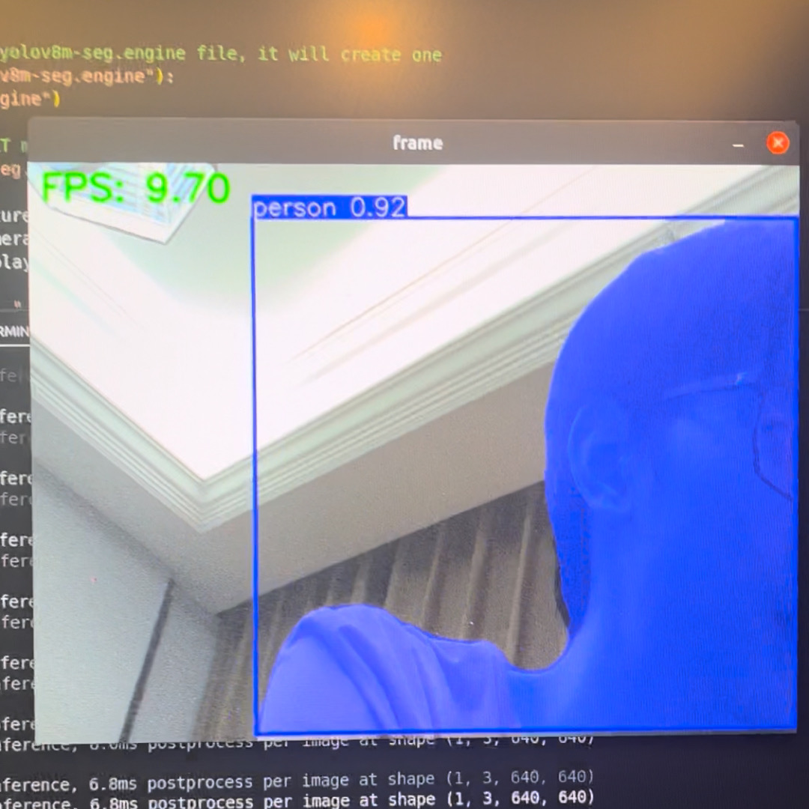

# YOLOv8 Segmentation With CSI Camera

This Chapter will teach you how to use CSI camera with Jetson Orin Nano in Python. 

### Rebuild OpenCV With GStreamer Support

Activate your yolov8 environment by using `conda activate yolov8 ` in terminal.

```shell
# go to the dependency directory 
cd ~/Dependency
# clone the newest git repository of opencv-python
git clone --recursive https://github.com/opencv/opencv-python.git
# go to the cloned directory
cd opencv-python
# install dependecies
sudo apt-get update
sudo apt-get install -y build-essential cmake git libgtk2.0-dev pkg-config libavcodec-dev libavformat-dev libswscale-dev
sudo apt-get install -y python3-dev python3-numpy libtbb2 libtbb-dev libjpeg-dev libpng-dev libtiff-dev libdc1394-22-dev
sudo apt install libgphoto2-dev
# Set CMake flags
export CMAKE_ARGS="-DWITH_TBB=ON -DWITH_V4L=ON -DWITH_QT=ON -DWITH_OPENGL=ON -DWITH_GTK=ON -DWITH_FFMPEG=ON -DWITH_IPP=ON -DWITH_OPENMP=ON -DWITH_OPENCL=ON -DWITH_CUBLAS=ON -DWITH_NVCUVID=ON -DWITH_EIGEN=ON -DWITH_GSTREAMER=ON -DWITH_LAPACK=ON -DWITH_TIFF=ON -DWITH_JASPER=ON -DWITH_WEBP=ON -DWITH_OPENEXR=ON -DWITH_PROTOBUF=ON -DWITH_1394=ON -DWITH_GPHOTO2=ON -DWITH_LAPACK=ON -DWITH_XINE=ON"

export ENABLE_CONTRIB=0
export ENABLE_HEADLESS=1
# Build the wheel
pip wheel . --verbose
# install 
pip install #thewheelfilegenerated under dir.whl
```

After install opencv-headless, use pip list show opencv-python-headless to make sure your opencv is perfectly installed under conda environment.

### Run the Segmentation Test

This code will use the yolov8m-seg.pt as a source to generate the TensorRT model, then open a video stream on camera0, which means you should plug in the fpc cable to the CAM0 port on Jetson Orin Nano Module.

```python
import os
import cv2
from ultralytics import YOLO
import time

# create a tensorRT model from a YOLOv8 PyTorch model
model = YOLO("yolov8m-seg.pt")

# export the model
# if the dir do not have a yolov8m-seg.engine file, it will create one
if not os.path.exists("yolov8m-seg.engine"):
    model.export(format="engine")

# load the exported TensorRT model
trt_model = YOLO("yolov8m-seg.engine")

def gstreamer_pipeline(capture_width=1920, capture_height=1080,
                       framerate=30, flip_method=0,
                       display_width=640, display_height=480):
    return (
        "nvarguscamerasrc ! "
        "video/x-raw(memory:NVMM), "
        "width=(int)%d, height=(int)%d, "
        "format=(string)NV12, framerate=(fraction)%d/1 ! "
        "nvvidconv flip-method=%d ! "
        "video/x-raw, width=(int)%d, height=(int)%d, format=(string)BGRx ! "
        "videoconvert ! "
        "video/x-raw, format=(string)BGR ! appsink"
        % (
            capture_width,
            capture_height,
            framerate,
            flip_method,
            display_width,
            display_height,
        )
    )

video_cap = cv2.VideoCapture(gstreamer_pipeline(), cv2.CAP_GSTREAMER)

while video_cap.isOpened():
    success, frame = video_cap.read()
    if success:
        start = time.perf_counter()

        results = trt_model(frame)

        end = time.perf_counter()

        total_time = end - start
        fps = 1 / total_time

        # Visualize the results
        annotated_frame = results[0].plot()

        # Convert color space from RGB to BGR
        annotated_frame = cv2.cvtColor(annotated_frame, cv2.COLOR_RGB2BGR)

        # Display the frame
        cv2.putText(annotated_frame, f"FPS: {fps:.2f}", (10, 30), cv2.FONT_HERSHEY_SIMPLEX, 1,
                    (0, 255, 0), 2, cv2.LINE_AA)
        cv2.imshow("frame", annotated_frame)
				# Press q on the keyborad to exit
        if cv2.waitKey(1) & 0xFF == ord("q"):
            break
    else:
        break

# Release the video capture object
video_cap.release()
cv2.destroyAllWindows()
```



### Knowing Running Issues

- `ImportError: /lib/x86_64-linux-gnu/libp11-kit.so.0: undefined symbol: ffi_type_pointer, version LIBFFI_BASE_7.0`
```shell
# reinstall.
sudo apt install --reinstall libffi7 libp11-kit0
# find all version of libffi
sudo apt list --installed | grep libffi
# find the location of libffi under /usr
sudo find /usr -name libffi.so.7
# link the local source to conda env
ln -sf /your/path/to/libffi.so.7 ~/anaconda3/envs/[your_env_name]/lib/libffi.so.7
```

- `ImportError: /lib/aarch64-linux-gnu/libgomp.so.1: cannot allocate memory in static TLS block` . It is the bug of arm machine.

```shell
# only way to solve this is to export the environment variable before excute
export LD_PRELOAD=/usr/lib/aarch64-linux-gnu/libgomp.so.1
```

or export in the file

```python
import os
os.environ['LD_PRELOAD'] = '/usr/lib/aarch64-linux-gnu/libgomp.so.1'
import cv2
```

- After running, you may see `GStreamer-WARNING **: … Failed to load plugin … libgstlibav.so … libgomp.so.1: cannot allocate memory in static TLS block`

```shell
# if you have installed gstreamer, you can find libgstlibav.so in /usr/lib/aarch64-linux-gnu/gstreamer-1.0/libgstlibav.so, you can remove the GStreamer cache to fix it:
rm -rf ~/.cache/gstreamer-1.0/
```

